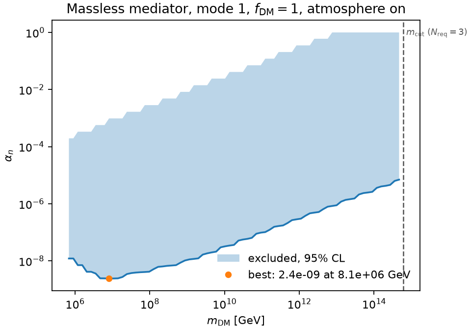

# Data release: First Search for Ultraheavy Dark Matter Using a Magnetically Levitated Particle

The complete limit-setting calculation behind the paper, as one self-describing
HDF5 file. For every point of a grid over dark-matter fraction, atmospheric
propagation, sensor mode, coupling, dark-matter mass and mediator range it
stores the expected signal, the expected number of in-reach transits, and the
optimum-interval extremeness from which the exclusion at any confidence level
is a level set. You can re-derive the published limit, quote it at a different
confidence level, reinterpret it for a different dark-matter fraction, or
compare against it, without rerunning any of the physics and without installing
any of our software.

|  |  |
|---|---|
| **Paper** | D. G. Uitenbroek, D. W. P. Amaral, J. Qin, J. Langendorff, A. Gingerich, T. H. Oosterkamp and C. D. Tunnell, *First Search for Ultraheavy Dark Matter Using a Magnetically Levitated Particle*. arXiv identifier and journal reference to be assigned. |
| **Release version** | `v5.0-night-m0p356mg-bcap10cm` |
| **Dataset DOI** | to be assigned |
| **Date** | 2026-08-08 (cube built 2026-08-08T12:10:42Z) |
| **License** | Data: [CC BY 4.0](LICENSE). Code, including `luhdm_release.py`: GPL-3.0-or-later. See [§13](#13-license-and-contact). |
| **Code repository** | <https://github.com/PolonaiseExperiment/luhdm> |
| **Contact** | Dorian W. P. Amaral, <damaral@ifae.es>, or open an issue on the code repository |
| **Requirements** | Python with `numpy` and `h5py`. Nothing else. |

> **Trust the file over this text.** Every version tag, axis length, event count
> and physics constant quoted below is also stored inside the HDF5 file and is
> read back from it. `python luhdm_release.py luhdm_datarelease_v5.h5` prints all
> of them; [§1](#1-quickstart) shows how to read them with five lines of `h5py`.
> Every example in this document was executed against the released file and its
> output pasted verbatim. All of them assume you are working in the directory
> that holds the release file; otherwise give a full path.

**Contents.** [1 Quickstart](#1-quickstart) &middot;
[2 Files](#2-files-in-this-release) &middot;
[3 What the data is](#3-what-the-data-is) &middot;
[4 Data dictionary](#4-file-layout-and-data-dictionary) &middot;
[5 Conventions](#5-conventions-you-have-to-get-right) &middot;
[6 Worked example](#6-worked-example-the-published-limit) &middot;
[7 Standalone reader](#7-the-standalone-reader) &middot;
[8 Intended use](#8-intended-use) &middot;
[9 Known limitations](#9-known-limitations) &middot;
[10 Integrity and provenance](#10-integrity-provenance-and-environment) &middot;
[11 Versions](#11-versions) &middot;
[12 How to cite](#12-how-to-cite) &middot;
[13 License and contact](#13-license-and-contact) &middot;
[14 Glossary](#14-glossary)

---

## 1. Quickstart

Download `luhdm_datarelease_v5.h5`, then:

```python
import h5py, numpy as np

with h5py.File("luhdm_datarelease_v5.h5", "r") as f:
    ext = f["results/extremeness"]
    print(f.attrs["version_tag"], ext.shape, list(ext.attrs["DIMENSION_LABELS"]))
    p = ext[1, 0, 0]                     # f_dm = 1.0, atmosphere on, mode 1
    print("excluded at 95% CL:", int((p >= 0.95).sum()), "of", p.size, "grid points")
```

```
v5.0-night-m0p356mg-bcap10cm (2, 2, 3, 44, 119, 55) ['f_dm', 'atmosphere', 'mode', 'alpha_n', 'mass_gev', 'lambda_m']
excluded at 95% CL: 47833 of 287980 grid points
```

That is the whole interface: a dense array, its axis names attached, and one
comparison. Exclusion at confidence `C` is the level set `extremeness >= C`.

The hard-coded leading indices in that snippet are there to keep it to five
lines. **Do not do that in real code**: resolve indices from the axes, as in
[§5.1](#51-the-hypothesis-axes-and-the-atmosphere-ordering). One of them is a
trap, and it is documented there.

From the shell, if you have the HDF5 command-line tools (they ship with the
HDF5 C library, not with `pip install h5py`):

```console
$ h5ls -r luhdm_datarelease_v5.h5 | head
```

```
/                        Group
/axes                    Group
/axes/alpha_halo_n       Dataset {64}
/axes/alpha_n            Dataset {44}
/axes/atmosphere         Dataset {2}
/axes/f_dm               Dataset {2}
/axes/lambda_m           Dataset {55}
/axes/m_phi_gev          Dataset {55}
/axes/mass_gev           Dataset {119}
/axes/mass_halo_gev      Dataset {64}
```

The file is plain HDF5 with dimension scales and per-dataset `units` and
`description` attributes, so `h5py`, `h5dump`, MATLAB, Julia, IDL and xarray
(through h5netcdf) all open it. There is no collaboration software to install.

---

## 2. Files in this release

| file | size | what it is |
|---|---|---|
| `luhdm_datarelease_v5.h5` | 14.8 MB | **The dataset.** Axes, results cube, detector inputs, halo diagnostics and reference curves. Self-describing; sufficient on its own. |
| `luhdm_release.py` | 51 kB | **Optional** single-file reader. `numpy` and `h5py` only, `pandas` optional. Copy it next to the HDF5 and import it. Described in [§7](#7-the-standalone-reader). |
| `README.md` | 61 kB | This document. |
| `SHA256SUMS` | 0.6 kB | SHA-256 digest of every file above and below. See [§10](#10-integrity-provenance-and-environment). |
| `provenance.json` | 262 kB | Build-side record: assembly command line, per-input records, impact-parameter cap block. Not needed to use the data; the same information is in the file's own attributes. |
| `CITATION.cff` | 3.5 kB | Machine-readable citation metadata. See [§12](#12-how-to-cite). |
| `exclusion_massless_mode1.png` | 57 kB | The figure produced by [§6](#6-worked-example-the-published-limit), for reference. |
| `LICENSE` | 19 kB | CC BY 4.0, the licence of the **data**. `luhdm_release.py` is code and is GPL-3.0-or-later instead. See [§13](#13-license-and-contact). |

**The two files you need are `luhdm_datarelease_v5.h5` and this README.** Add
`luhdm_release.py` if you want value-based selection instead of integer
indices. Everything else is provenance and convenience.

Notebooks that reproduce every figure in the paper and its Supplemental
Material from the cube alone live in
[`notebooks/`](https://github.com/PolonaiseExperiment/luhdm/tree/main/notebooks)
in the code repository.

---

## 3. What the data is

A search for **ultraheavy dark matter** with a **levitated micro-sensor**. A
magnetically levitated microsphere (0.356 mg, effective radius 0.26 mm,
N = 1.07 × 10²⁰ neutrons) held in a superconducting trap is monitored for sudden
momentum impulses. A dark-matter particle of mass `m_DM` flying past the sphere
with impact parameter `b` transfers momentum through a new Yukawa-type
interaction with the sphere's neutrons, of strength `alpha_n` per neutron and
range `lambda` (mediator mass `m_phi = 1/lambda` in natural units; `lambda → ∞`
is the massless, Coulomb-like limit). Because the dark-matter number density
falls as `1/m_DM` while the momentum kick grows with it, a single sphere is
sensitive to masses far above the WIMP range, here 10⁵ to 1.22 × 10¹⁹ GeV.
Strongly coupled candidates also lose energy crossing the atmosphere and
overburden before reaching the detector, which both attenuates and reshapes the
arrival-velocity distribution. This release carries the analysis **with and
without** that propagation.

### The selection it encodes

The release describes the **night selection**. The dark-matter dataset was
recorded between 22 December 2025 and 21 January 2026. Only night-time data are
analysed, 19:00 to 07:00 local time, when nobody is expected to be in the
laboratory; 19 and 20 January are excluded, when work on the still suspension
and a deliberate vibration test disturbed the apparatus, as are the periods when
the calibration drive was on. What remains is a live time of
`T_obs = 790 778 s` (219.66 h, 9.15 days, 31% of the 30.0-day run), recorded in
`attrs['t_exposure_s']` and in `detector/exposure_s`.

Three translational eigenmodes of the trapped sphere, at 51.2365, 59.4663 and
94.86 Hz, are demodulated from the same readout stream and analysed
independently. They are indexed 1, 2, 3 by ascending frequency. **The paper
reports the search on mode 1**; modes 2 and 3 are carried through the identical
chain as cross-checks. All three are in this file.

After the full selection above the 100 GeV analysis threshold, the surviving
impulse candidates number **8, 26 and 126** for modes 1, 2 and 3. Those lists
are `detector/events_mode{1,2,3}`, and `detector/exposure_s` is their live time.

The larger lists (66, 99 and 443 entries) that ship alongside as
`detector/all_blips_mode{1,2,3}` are **not** the night pre-selection of those
candidates: they are every up-crossing above the 100 GeV threshold over the
whole unvetoed run, about 469.7 h, so `detector/exposure_s` does **not**
normalise them. They carry no per-blip time, segment or drive-state metadata,
so the night selection cannot be re-derived or re-cut from them; they ship for
context, to show the scale of the raw transient population the selection acts
on. **They are also in different units** — eV, against GeV for the candidates:
see [§4.3](#43-detector).

### The interaction model, in one paragraph

The differential cross section for a flyby is built from the impulse delivered
along a straight-line trajectory. Two cutoffs bound the impact-parameter
integral. The **outer** cutoff is `b_constrained_max = 0.1 m`
(`attrs['b_constrained_max_m']`), the scale of the cryogenic hardware
surrounding the trap, applied identically in the cross section and in the
geometric transit count. The **inner** cutoff is the sphere's own effective
radius: no trajectory approaches closer than `R_eff` (`attrs['r_eff_m']` =
2.6 × 10⁻⁴ m), so in the massless limit the impulse saturates at

```
q_max = 2 alpha_n / (v R_eff)
```

and `dsigma/dq` vanishes identically above it. This is the massless limit of the
finite-range cutoff the Yukawa branch already applies, and it removes the
contribution of arbitrarily close approaches. The outer cap is a stated analysis
choice, not a measured quantity; discarding the large-`b` wedge can only remove
signal, so the exclusion reported here is contained within the one the same data
would give uncapped. See [§9](#9-known-limitations).

---

## 4. File layout and data dictionary

Every dataset under `/results` and `/halo` carries HDF5 **dimension scales**, so
its axes are self-identifying: `ds.attrs['DIMENSION_LABELS']` names them in
order and each is attached to the matching `/axes/<name>` dataset. Read the axis
order from there rather than assuming it. Every dataset also carries `units` and
`description` attributes.

Symbolic lengths, with this release's values in the last column:

| symbol | meaning | value |
|---|---|---|
| `n_f` | dark-matter fraction hypotheses | 2 |
| `n_atm` | atmosphere hypotheses | 2 |
| `n_mode` | sensor modes | 3 |
| `n_alpha` | coupling grid points | 44 |
| `n_mass` | dark-matter mass grid points | 119 |
| `n_lam` | mediator ranges, **finite plus 1 massless sentinel** | 55 (54 + 1) |
| `n_halo` | coupling and mass points of the halo diagnostic maps | 64 |

### 4.1 `/axes`

The coordinate arrays. No missing-value codes: every entry is a valid grid
point, and the only non-finite value anywhere is the deliberate `inf` sentinel
in `lambda_m`.

| dataset | shape | dtype | units | meaning |
|---|---|---|---|---|
| `f_dm` | (`n_f`,) | f8 | 1 | fraction of the local dark-matter density carried by this species. A **pure flux normalisation**: `mu` and `n_transit` are exactly linear in it. Values `[0.1, 1.0]`. |
| `atmosphere` | (`n_atm`,) | i1 | bool | `1` = propagation through atmosphere and overburden applied; `0` = bare halo flux. Stored in the order `[1, 0]`, so **index 0 is atmosphere ON.** |
| `mode` | (`n_mode`,) | u1 | 1 | sensor mode label (1, 2, 3), by ascending eigenfrequency (51.2365, 59.4663, 94.86 Hz). Modes differ in threshold and efficiency, hence in their event lists. |
| `alpha_n` | (`n_alpha`,) | f8 | 1 | per-neutron coupling, log-spaced 10⁻¹⁰ to 1, 0.2326 dex per step. This is the parameter the limit is set on. |
| `mass_gev` | (`n_mass`,) | f8 | GeV | dark-matter mass, log-spaced 10⁵ to 1.22 × 10¹⁹ (the Planck mass), 0.1194 dex per step. |
| `lambda_m` | (`n_lam`,) | f8 | m | mediator range, 10⁻⁷ m to 2 m: finite values **ascending**, then `inf` last. See below. |
| `m_phi_gev` | (`n_lam`,) | f8 | GeV | mediator mass `1/lambda` in natural units, parallel to `lambda_m`; exactly `0.0` at the `inf` entry. |
| `alpha_halo_n` | (`n_halo`,) | f8 | 1 | coupling axis of the `/halo` maps, extending down to 2 × 10⁻¹¹. |
| `mass_halo_gev` | (`n_halo`,) | f8 | GeV | mass axis of the `/halo` maps. |

**The massless slice.** The last element of `lambda_m` is `inf`, with
`m_phi_gev = 0.0`: the analytic, Coulomb-like limit of a massless mediator. The
number of finite entries is the `n_finite` attribute of `axes/lambda_m` (54
here), so the finite part is `lambda_m[:n_finite]` and the massless index is the
one where `~np.isfinite(lambda_m)`. Never assume it is `-1` by arithmetic on a
hard-coded length. Read `n_finite`.

**Named ranges.** `axes/lambda_m` carries a `tags_json` attribute mapping short
names to exact axis values, so tag-based slicing is an integer index with no
tolerance games:

```python
import h5py, json

with h5py.File("luhdm_datarelease_v5.h5", "r") as f:
    tags = json.loads(f["axes/lambda_m"].attrs["tags_json"])
print(tags)
```

```
{'2m': 2.0, '20cm': 0.2, '2cm': 0.02, '2mm': 0.002, '200um': 0.0002, '20um': 2e-05, '10um': 1e-05, '2um': 2e-06}
```

The eight named ranges span 2 m down to 2 µm. The 0.2 m point sits just above
the 0.1 m impact-parameter cap and is useful for seeing where the cap, rather
than the mediator range, starts to set the reach. See
[§9](#9-known-limitations).

### 4.2 `/results`

The analysis cube.

| dataset | shape | dtype | units | meaning |
|---|---|---|---|---|
| `extremeness` | (`n_f`, `n_atm`, `n_mode`, `n_alpha`, `n_mass`, `n_lam`) | f4 | 1 | optimum-interval extremeness: the probability that a background-free pseudo-experiment under this hypothesis looks *less* extreme than the data. **Exclusion at confidence `C` is the level set `extremeness >= C`.** `NaN` where `status == 1`. |
| `mu` | same | f4 | counts | expected detected signal events, efficiency folded in. `NaN` where `status == 1`. Exactly linear in `f_DM`. |
| `status` | same | u1 | enum | how the cell was obtained. See [§4.6](#46-status-codes-and-the-nan-policy). |
| `n_transit` | (`n_f`, `n_atm`, `n_alpha`, `n_mass`, `n_lam`) | f4 | counts | expected number of dark-matter transits within threshold reach. **No `mode` axis**: the flyby rate does not depend on which sensor mode you read out. Clipped at `>= 0` (`clipped_nonnegative` attribute); exactly linear in `f_DM`. `NaN` at cells where the calculation raised. |

`NaN` is the missing-value code throughout, and it is exactly coincident with
`status == 1`.

### 4.3 `/detector`

The analysis inputs.

| dataset | shape | dtype | units | meaning |
|---|---|---|---|---|
| `exposure_s` | scalar | f8 | s | total live time, 790 778 s. |
| `events_mode{1,2,3}` | (8,) (26,) (126,) | f8 | **GeV** | **the analysis event lists**: momentum kicks surviving the full selection. The limit is set on these. |
| `all_blips_mode{1,2,3}` | (66,) (99,) (443,) | f8 | **eV** | every reconstructed up-crossing above the 100 GeV threshold over the **whole unvetoed run** (~469.7 h), not the night pre-selection. `exposure_s` does not apply to them and they carry no time or drive-state metadata. Context only. |
| `q_gev_{1,2,3}` | (400,) | f8 | GeV | momentum grid of the measured efficiency curves. |
| `eff_{1,2,3}_df{2,3}` | (400,) | f8 | 1 | measured detection efficiency ε(q) per mode, for the two degrees-of-freedom hypotheses of the efficiency fit. The analysis used `df` = `attrs['df']` (3). |

> **The two impulse lists are in different units.** `events_mode{n}` is in GeV
> and `all_blips_mode{n}` is in eV, a factor of 1e9 between two datasets in the
> same group. Plotted on one axis without conversion they look plausible and are
> wrong by nine orders of magnitude. Divide the blip momenta by 1e9 before
> comparing. Each dataset carries its own `units` attribute; read it.

```python
import h5py, numpy as np

with h5py.File("luhdm_datarelease_v5.h5", "r") as f:
    ev = f["detector/events_mode1"][:]          # GeV
    bl = f["detector/all_blips_mode1"][:]       # eV
    print("events_mode1   units =", f["detector/events_mode1"].attrs["units"],
          f"  range {ev.min():.1f} .. {ev.max():.1f}")
    print("all_blips_mode1 units =", f["detector/all_blips_mode1"].attrs["units"],
          f"  range {bl.min():.3e} .. {bl.max():.3e}")

blips_gev = bl / 1e9                            # eV -> GeV
print("after conversion the events are a subset of the blips:",
      all(np.isclose(blips_gev, e).any() for e in ev))
```

```
events_mode1   units = GeV   range 1520.7 .. 12790.7
all_blips_mode1 units = eV   range 8.610e+11 .. 1.265e+14
after conversion the events are a subset of the blips: True
```

Event-list lengths are data, not schema: they change with the selection.
[§7.1](#71-detector-inputs) works through reading these.

### 4.4 `/halo`

Flux diagnostics, optional.

| dataset | shape | dtype | units | meaning |
|---|---|---|---|---|
| `n_transit` | (`n_halo`, `n_halo`, `n_lam`) | f4 | counts | unattenuated-halo expected transits on the coarser diagnostic grid. |
| `bmax` | (`n_halo`, `n_halo`, `n_lam`) | f4 | m | flux-averaged threshold reach √⟨b²⟩, how far out a transit can still push the sensor over threshold. |

These are an **independently sampled, coarser** map, with their own
`alpha_halo_n` and `mass_halo_gev` axes, used for intuition and figures. They
are stored at the **baseline `f_DM`** (`attrs['f_dm_default']` = 0.1) with no
`f_dm` axis; multiply by `f_DM / 0.1` for another fraction. Where their grid
meets the main cube they agree with `/results/n_transit` at `atmosphere = 0` to
about 0.2%, the residual being Monte-Carlo sampling noise between the two
passes. **For anything quantitative use `/results`.**

### 4.5 `/reference_curves`

Showcase spectra for figures, all at the single point `m_DM = 10⁸ GeV`,
`alpha_n = 10⁻³`. Not needed to use the limits.

| dataset | shape | units | meaning |
|---|---|---|---|
| `v` | (500,) | c | arrival-speed grid, shared by every `fv_*`. |
| `fv_<tag>` | (500,) | (v/c)⁻¹ | attenuated arrival-speed distribution for each of the eight named ranges. Each carries a `survival_fraction` attribute (0.36 at 2 m rising to 0.90 at 20 µm). |
| `fv_shm` | (500,) | (v/c)⁻¹ | the unattenuated standard-halo-model distribution, `survival_fraction` 1.0. |
| `q_gev` | (160,) | GeV | momentum-kick grid, shared by every `drdq_*`. |
| `drdq_<tag>`, `drdq_massless` | (160,) | s⁻¹ GeV⁻¹ | raw differential rate dR/dq with no efficiency applied, one per named range plus the massless limit. |

There are nine `drdq_*` curves (eight named ranges plus `massless`) but only
eight attenuated `fv_*` curves. That asymmetry is deliberate and is recorded in
the `description` attributes: attenuation is computed per finite range, so there
is no massless arrival distribution, and **every `drdq_*` curve, including
`drdq_massless`, is drawn with the 200 µm arrival distribution** so that the
curves differ only through the cross section. `fv_shm` completes the set on the
`fv_*` side as the unattenuated reference.

### 4.6 Status codes and the NaN policy

`/results/status` records how each cell was obtained. Its `description`
attribute is the authoritative short form; the long form:

| code | meaning | `extremeness` |
|---|---|---|
| `0` | the optimum-interval Monte Carlo ran | MC value in (0, 1) |
| `1` | **the cell raised an exception** | `NaN`, and `mu` and `n_transit` are `NaN` too |
| `2` | `mu` below the MC floor (0.2), nothing to expect | exactly `0.0` |
| `3` | `mu` above the MC cap (85, `attrs['fid_mu_cap']`), asserted excluded | exactly `1.0` |
| `4` | the spectrum has no support, `mu == 0` | exactly `0.0` |

**Codes 2, 3 and 4 are deterministic shortcuts, not failures.** They are how the
scan avoids Monte Carlo where the answer is taken to be known, and they are the
majority of the cube. Code 3 in particular is an *assertion* rather than a
computation; see [§9](#9-known-limitations).

```python
import h5py, numpy as np

with h5py.File("luhdm_datarelease_v5.h5", "r") as f:
    st  = f["results/status"][:]
    ext = f["results/extremeness"][:]

codes, counts = np.unique(st, return_counts=True)
print({int(c): int(n) for c, n in zip(codes, counts)})
print("NaN extremeness exactly where status==1:",
      np.array_equal(np.isnan(ext), st == 1))
print("status-1 cells:", int((st == 1).sum()),
      f"({100 * (st == 1).mean():.2f}% of the cube)")
```

```
{0: 435797, 1: 52548, 2: 2226349, 3: 432844, 4: 308222}
NaN extremeness exactly where status==1: True
status-1 cells: 52548 (1.52% of the cube)
```

That is 12.6% code 0, 1.5% code 1, 64.4% code 2, 12.5% code 3, 8.9% code 4.

**Code 1 is a failure and needs care.** `extremeness` is `NaN` there, and
`NaN >= 0.95` is `False`, so **a failed cell silently reads as "not excluded"**
in any naive level set. That is the published convention and this release does
not change it, but you should know where those cells are; see
[§9](#9-known-limitations) for how far they sit from any contour.

The failures are a cross-section interpolant underflowing its tabulation floor
at the strongest couplings and heaviest masses in the few-µm mediator range. A
cell-level failure marks all three modes, so `n_transit`, which has no mode
axis, is `NaN` at exactly the cells where any mode has `status == 1`.

The standalone reader's `excluded_band()` counts them for you
(`band.n_undefined` per mass) and warns unless you pass `nan_policy='ignore'`.

---

## 5. Conventions you have to get right

Three of them. The first is the one people get wrong.

### 5.1 The hypothesis axes, and the atmosphere ordering

The two leading axes of every `/results` dataset are *hypotheses*, not
measurements. Every combination is fully computed, so the cube contains four
parallel analyses:

|  | `atmosphere = 1` (attenuated) | `atmosphere = 0` (bare halo) |
|---|---|---|
| **`f_dm = 0.1`** | this species is a tenth of the dark matter; the plane the composite cross-section benchmark is quoted on | the same, with no overburden |
| **`f_dm = 1.0`** | this species is all of the dark matter; the plane the paper's `alpha_n` limits are quoted on | the same, with no overburden |

* **`f_dm`** is the fraction of the local dark-matter density carried by this
  species. It enters only as a flux normalisation, so `mu` and `n_transit` scale
  exactly linearly with it. The `extremeness` does not: it is a non-linear
  function of `mu`. **Both planes are used in the paper**: the coupling limits
  are quoted at `f_DM = 1`, the presentation convention of the optically
  levitated searches, and the composite cross-section benchmark at `f_DM = 0.1`,
  the conventional subdominant choice that evades self-interaction constraints.
  `attrs['f_dm_default']` records the value the loader falls back to when a
  caller does not ask for one; it is not a statement about which plane a given
  published number is quoted on. The two differ materially — the 200 µm mode-1
  contour ends at 3.4 × 10⁹ GeV at `f_dm = 0.1` and 5.4 × 10¹⁰ GeV at
  `f_dm = 1.0` — so pick the plane deliberately.
* **`atmosphere`** selects whether the arrival flux has been propagated through
  the atmosphere and overburden. With attenuation ON, strongly coupled
  candidates are slowed or stopped before reaching the sensor, so the exclusion
  **closes from above** and becomes a two-sided band in `alpha_n`. With it OFF
  there is no such ceiling; see [§9](#9-known-limitations).

Select them by value, never by position:

```python
import h5py, numpy as np

with h5py.File("luhdm_datarelease_v5.h5", "r") as f:
    i_f   = int(np.flatnonzero(f["axes/f_dm"][:] == 0.1)[0])
    i_atm = int(np.flatnonzero(f["axes/atmosphere"][:] == 1)[0])   # 1 = attenuation ON
    i_mod = int(np.flatnonzero(f["axes/mode"][:] == 2)[0])
    print("indices:", i_f, i_atm, i_mod)
    print("axes/atmosphere is stored as", f["axes/atmosphere"][:], "-> ON is index", i_atm)
```

```
indices: 0 0 1
axes/atmosphere is stored as [1 0] -> ON is index 0
```

`axes/atmosphere` is `[1, 0]`, so **`atmosphere = 0` (bare halo) is index 1, not
index 0.** This is the single easiest thing to get wrong in this file.

### 5.2 Selecting a mediator range

`lambda_m` values are exact floats: the named tags and the round decades are
exact axis members, so `==` works for them. For anything else, snap to the
nearest point in log space and *check* what you got.

```python
import h5py, numpy as np

with h5py.File("luhdm_datarelease_v5.h5", "r") as f:
    lam = f["axes/lambda_m"][:]
    n_finite = int(f["axes/lambda_m"].attrs["n_finite"])

i_massless = int(np.flatnonzero(~np.isfinite(lam))[0])
i_200um    = int(np.flatnonzero(lam == 2e-4)[0])
i_20cm     = int(np.flatnonzero(lam == 0.2)[0])
i_near     = int(np.argmin(np.abs(np.log10(lam[:n_finite]) - np.log10(3.7e-5))))

print(f"massless -> index {i_massless} (lambda={lam[i_massless]})")
print(f"200 um   -> index {i_200um}")
print(f"0.2 m    -> index {i_20cm}")
print(f"3.7e-5 m -> nearest index {i_near}, lambda = {lam[i_near]:.6g} m")
```

```
massless -> index 54 (lambda=inf)
200 um   -> index 29
0.2 m    -> index 47
3.7e-5 m -> nearest index 24, lambda = 3.0831e-05 m
```

### 5.3 The exclusion convention

`extremeness` is the probability that a background-free pseudo-experiment under
a given hypothesis looks *less* extreme than the observed data, computed with
Yellin's optimum-interval method. A grid point is **excluded at confidence `C`**
when

```
extremeness >= C          # C = 0.95 for the published 95% CL limits
```

`attrs['confidence_recommended']` records the level the release is quoted at
(0.95). A two-dimensional exclusion region is just that level set: contour it
directly.

For a **boundary in the coupling** the project quotes the *interpolated*
crossing rather than the last excluded grid point. At each mass, take the run of
`alpha_n` indices with `extremeness >= C` and find where the level is crossed by
linear interpolation in `log10(alpha_n)` between the two bracketing points. If
the excluded run already starts at the first, or ends at the last, scanned
coupling, there is nothing to bracket and the edge **saturates** at that end of
the grid. Such an edge is a property of the scan range, not a measurement.

[§6](#6-worked-example-the-published-limit) is the complete implementation.

---

## 6. Worked example: the published limit

This reproduces the paper's headline number from the released file, in plain
numpy. It is the same arithmetic the analysis code runs, and the standalone
reader's `excluded_band()` is a wrapper around it.

```python
import h5py, numpy as np

C = 0.95                                    # confidence level, attrs['confidence_recommended']

with h5py.File("luhdm_datarelease_v5.h5", "r") as f:
    alpha = f["axes/alpha_n"][:]
    mass  = f["axes/mass_gev"][:]
    lam   = f["axes/lambda_m"][:]
    i_f   = int(np.flatnonzero(f["axes/f_dm"][:] == 1.0)[0])       # f_DM = 1
    i_atm = int(np.flatnonzero(f["axes/atmosphere"][:] == 1)[0])   # attenuation ON
    i_mod = int(np.flatnonzero(f["axes/mode"][:] == 1)[0])         # mode 1
    i_lam = int(np.flatnonzero(~np.isfinite(lam))[0])              # massless mediator
    p = f["results/extremeness"][i_f, i_atm, i_mod, :, :, i_lam]   # (alpha_n, mass_gev)

lo = np.full(mass.size, np.nan)             # lower edge of the excluded band, per mass
hi = np.full(mass.size, np.nan)             # upper edge
for j in range(mass.size):
    above = np.flatnonzero(p[:, j] >= C)                  # NaN compares False: not excluded
    if above.size == 0:
        continue
    a, b = above[0], above[-1]
    lo[j] = alpha[0] if a == 0 else 10 ** np.interp(
        C, p[a - 1:a + 1, j], np.log10(alpha[a - 1:a + 1]))
    hi[j] = alpha[-1] if b == alpha.size - 1 else 10 ** np.interp(
        -C, -p[b:b + 2, j], np.log10(alpha[b:b + 2]))

j = int(np.nanargmin(lo))                                 # strongest coupling reached
print(f"best limit  alpha_n = {lo[j]:.2g}  at m_DM = {mass[j]:.2g} GeV  ({C:.0%} CL)")
ok = np.isfinite(lo)
print(f"excluded at {ok.sum()} of {mass.size} masses, "
      f"m_DM = {mass[ok].min():.3g} .. {mass[ok].max():.3g} GeV")
```

```
best limit  alpha_n = 2.3e-09  at m_DM = 1.1e+07 GeV  (95% CL)
excluded at 76 of 119 masses, m_DM = 3e+05 .. 2.7e+14 GeV
```

Those are the abstract's numbers: for a massless mediator, couplings excluded
down to `alpha_n = 2.3 × 10⁻⁹` at 95% CL at a mass of 1.1 × 10⁷ GeV, with
sensitivity spanning 10⁵ to 10¹⁴ GeV.

The negations in the `hi` branch exist only to make the descending side
increasing for `np.interp`, which requires increasing `x`.

Continue in the same Python session to draw it. `matplotlib` is not part of the
`numpy` and `h5py` floor, so this block needs one more package:

```python
import matplotlib.pyplot as plt

fig, ax = plt.subplots(figsize=(6.0, 4.2), constrained_layout=True)
ax.fill_between(mass[ok], lo[ok], hi[ok], alpha=0.30, label="excluded, 95% CL")
ax.plot(mass[ok], lo[ok], lw=1.6)
ax.plot(mass[j], lo[j], "o", ms=5, label=f"best: {lo[j]:.2g} at {mass[j]:.2g} GeV")
ax.set(xscale="log", yscale="log", xlabel=r"$m_{\rm DM}$ [GeV]", ylabel=r"$\alpha_n$",
       title="Massless mediator, mode 1, $f_{\\rm DM}=1$, atmosphere on")
ax.legend(loc="lower right", frameon=False)
fig.savefig("exclusion_massless_mode1.png", dpi=160)
print("wrote exclusion_massless_mode1.png")
```

```
wrote exclusion_massless_mode1.png
```



The file that block writes is shipped as
[`exclusion_massless_mode1.png`](exclusion_massless_mode1.png), so you can check
your copy against ours.

For a different mediator range, replace the `i_lam` line with
`int(np.flatnonzero(lam == 2e-4)[0])`. For a different confidence level, change
`C`. For a different mode or dark-matter fraction, change the value matched on
the corresponding axis. Nothing else in the block changes.

---

## 7. The standalone reader

[`luhdm_release.py`](luhdm_release.py) is a **single self-contained file**. Copy
it next to the HDF5 and import it: there is no package to install, no relative
imports, no data files, and it never imports the analysis code. Its only
requirements are `numpy` and `h5py`; `pandas` is imported lazily inside
`to_dataframe()` and is optional. It is also readable as reference, since
everything it does is a few lines of numpy.

What it adds over raw `h5py`:

* **selection by physical value**: `mode=2`, `lam='200um'` or `lam=20e-6` or
  `lam='massless'`, `f_dm=0.1`, `atmosphere=True`, `mass=1e8`, `alpha=1e-3`,
  with errors that list the available values when a request misses;
* slices returned **with their axes attached**, and the resolved grid values
  echoed back so you can see what `mass=1e8` snapped to;
* `excluded_band()` implementing [§5.3](#53-the-exclusion-convention), including
  saturation flags and an explicit count of undefined (status-1) cells;
* `efficiency_curve()`, `events()`, `all_blips()` and `exposure_s` for the
  detector inputs, see [§7.1](#71-detector-inputs);
* `summary()`, which prints everything in this README read out of the file you
  actually have;
* `to_dataframe()`, a tidy long-format table for a chosen hypothesis;
* it is **schema-driven**: axis names, lengths, units, tags and the massless
  sentinel all come from the file, so it keeps working across cube versions.

Run it on a file to see what you have:

```console
$ python luhdm_release.py luhdm_datarelease_v5.h5
```

```
==============================================================================
POLONAISE UHDM data release   v5.0-night-m0p356mg-bcap10cm
==============================================================================
file            : luhdm_datarelease_v5.h5
format          : luhdm-datarelease version 2 (schema 1)
created         : 2026-08-08T12:10:42.831616+00:00
exposure        : 790,778 s  (219.66 h)
impact-param cap: 0.1 m
recommended CL  : 0.95

hypothesis axes
  f_dm          : [0.1, 1.0]  (default 0.1) -- DM fraction, pure flux scale
  atmosphere    : [1, 0] -> [True, False]  (1/True = attenuation applied)
  mode          : [1, 2, 3]

axes
  alpha_halo_n    n=64    2e-11 .. 1                   [1]
                  coupling alpha_n (halo/flux-map 64 grid)
  alpha_n         n=44    1e-10 .. 1                   [1]
                  per-neutron coupling alpha_n
  atmosphere      n=2     [1, 0]                       [bool]
                  1 = attenuation through the atmosphere/earth applied (atm pass); 0 = bare halo flux (noatm pass)
  f_dm            n=2     [0.1, 1]                     [1]
                  dark-matter fraction hypothesis of this species; a pure flux normalisation (n_dm ∝ f_DM)
  lambda_m        n=55    1e-07 .. 2                   [m]  [54 finite + 1 massless sentinel(inf); tags: 10um, 200um, 20cm, 20um, 2cm, 2m, 2mm, 2um, massless]
                  mediator range; finite ascending then inf (massless) last
  m_phi_gev       n=55    0 .. 1.973e-09               [GeV]
                  mediator mass = 1/conv_m2pGeV(lambda); exactly 0 at inf
  mass_gev        n=119   1e+05 .. 1.22e+19            [GeV]
                  dark-matter mass (shared by both atmosphere planes)
  mass_halo_gev   n=64    1e+05 .. 1.22e+19            [GeV]
                  dark-matter mass (halo/flux-map 64 grid)
  mode            n=3     [1, 2, 3]                    [1]
                  sensor mode index (1,2,3)

results  (axis order in parentheses)
  extremeness     (2, 2, 3, 44, 119, 55)     float32  [1]
                  (f_dm, atmosphere, mode, alpha_n, mass_gev, lambda_m)
                  optimum-interval extremeness / confidence; NaN where status==1
  mu              (2, 2, 3, 44, 119, 55)     float32  [counts]
                  (f_dm, atmosphere, mode, alpha_n, mass_gev, lambda_m)
                  expected signal counts mu; NaN where status==1. Exactly linear in f_DM (a pure flux normalisation).
  n_transit       (2, 2, 44, 119, 55)        float32  [counts]
                  (f_dm, atmosphere, alpha_n, mass_gev, lambda_m)
                  expected within-reach transits; clipped >=0 (KDE tail can oscillate slightly negative). Exactly linear in f_DM.
  status          (2, 2, 3, 44, 119, 55)     uint8    [enum]
                  (f_dm, atmosphere, mode, alpha_n, mass_gev, lambda_m)
                  0=ok(MC) 1=exception 2=mu<0.2 3=mu>mu_cap 4=mu==0

status codes  (counts over the whole cube)
  0       435,797  (12.61%)  ok(MC): the optimum-interval Monte Carlo ran
  1        52,548  ( 1.52%)  exception: the cell raised; extremeness/mu/n_transit are NaN, and NaN reads as NOT excluded
  2     2,226,349  (64.42%)  mu<0.2: expected counts below the MC floor; extremeness is exactly 0
  3       432,844  (12.53%)  mu>mu_cap: expected counts above the MC cap; extremeness is exactly 1 (excluded)
  4       308,222  ( 8.92%)  mu==0: the spectrum has no support; extremeness is exactly 0

detector
  exposure_s     790,778 s
  mode 1:    8 analysis events (1521 .. 1.279e+04 GeV), 66 raw blips
  mode 2:   26 analysis events (554.2 .. 8473 GeV), 99 raw blips
  mode 3:  126 analysis events (1569 .. 1.723e+04 GeV), 443 raw blips
  efficiency     q_gev_<mode>, eff_<mode>_df<2|3>; analysis used df=3

halo diagnostics (own coarser alpha/mass grids)
  bmax            (64, 64, 55)               [m]  flux-averaged threshold reach sqrt(<pi b^2>/pi)
  n_transit       (64, 64, 55)               [counts]  unattenuated-halo expected transits

reference_curves: 20 datasets (showcase spectra / arrival-speed distributions)

provenance
  git_commit     ca347ce287a33995686a9c552a05e3809ad88aa7 (dirty=False)
  seed           20260702
  MC fidelity    n_mc=10000 n_ode=400 n_shm=300000 n_q=240
  packages       {"numpy": "2.5.1", "scipy": "1.18.0", "h5py": "3.16.0", "optimum_interval": "0.3.0", "luhdm": "0.1.0", "matplotlib": "3.11.1", "pandas": "3.0.3", "python": "3.14.6"}
  events_mode1_sha256 9bdc69c90b6f9e80db114821e1af363157a1a55c260907e2d4ebfc0641c1f5b6
  events_mode2_sha256 9b78181c959266873dafabe2db4ae8227ed61e10e1b363282be521123ea0ea50
  events_mode3_sha256 31e611787b087d6f6494422d8485a5a51d97168eb6b3b34dd6920840c396f105
  efficiency_npz_sha256  451e6ca10c759ecbe4620672796f3571538914dd7c7dba63fd679710d04183b3
==============================================================================
```

`python luhdm_release.py --help` prints the module documentation and the usage
line. The API is in the docstrings: `help(luhdm_release)` and
`help(luhdm_release.Release)` work offline.

```python
import numpy as np
import luhdm_release

with luhdm_release.open_release("luhdm_datarelease_v5.h5") as rel:
    print(rel)
    print("exposure", rel.exposure_s, "s, cap", rel.b_constrained_max_m, "m")

    sl = rel.get("extremeness", mode=1, lam="200um", f_dm=0.1, atmosphere=True)
    print(sl)                                   # axes travel with the array
    print("excluded cells:", int((sl.values >= 0.95).sum()))

    band = rel.excluded_band(mode=1, lam="200um")          # 95% CL, per mass
    print(band)
    j = int(np.flatnonzero(np.isfinite(band.alpha_lo))[0])
    print("at m =", band.mass_gev[j], "alpha_n in",
          (band.alpha_lo[j], band.alpha_hi[j]))

    cell = rel.cell(mode=2, alpha=1e-3, mass=1e8, lam="200um")
    print({k: cell[k] for k in ("mass_gev", "alpha_n", "mu", "extremeness", "status")})
```

```
<Release 'luhdm_datarelease_v5.h5' (v5.0-night-m0p356mg-bcap10cm)>
exposure 790778.0 s, cap 0.1 m
<Slice extremeness [1] (alpha_n=44, mass_gev=119) at f_dm=0.1, atmosphere=True, mode=1, lambda_m=0.0002>
excluded cells: 587
<ExcludedBand 95% CL at f_dm=0.1, atmosphere=True, mode=1, lambda_m=0.0002: 33/119 masses excluded, mass range 5.203e+05..3.438e+09 GeV>
at m = 520302.1070058871 alpha_n in (np.float64(8.841573381446489e-08), np.float64(0.00011664691612510738))
{'mass_gev': 96471330.72266711, 'alpha_n': 0.0009478599776522384, 'mu': 148.25978088378906, 'extremeness': 1.0, 'status': 3}
```

`to_dataframe()` is the one method that needs `pandas`, so it is in its own
block:

```python
import luhdm_release                                  # this block also needs pandas

with luhdm_release.open_release("luhdm_datarelease_v5.h5") as rel:
    df = rel.to_dataframe(mode=1, lam="massless", mass=1e12)
    print(df.shape, list(df.columns))
```

```
(44, 13) ['f_dm', 'atmosphere', 'mode', 'alpha_n', 'mass_gev', 'lambda_m', 'm_phi_gev', 'extremeness', 'mu', 'status', 'status_meaning', 'n_transit', 'excluded']
```

### 7.1 Detector inputs

The measured detection efficiency travels **inside the file**, so a
reinterpretation never has to reconstruct it. Each mode has its own momentum
grid `detector/q_gev_{mode}` and its efficiency `detector/eff_{mode}_df{2,3}`,
where `df` is the degrees-of-freedom hypothesis of the efficiency fit; the
analysis used `attrs['df']` = 3. The live time is `detector/exposure_s` and the
candidate lists are `detector/events_mode{n}`.

With the standalone reader, where `df` defaults to the file's own `attrs['df']`:

```python
import numpy as np
import luhdm_release

with luhdm_release.open_release("luhdm_datarelease_v5.h5") as rel:
    print("exposure_s :", rel.exposure_s, "s")
    for m in rel.modes:
        q, eff = rel.efficiency_curve(m)          # df defaults to attrs['df']
        ev = rel.events(m)
        i50 = int(np.argmin(np.abs(eff - 0.5)))
        print(f"mode {m}: {len(ev):3d} candidates, "
              f"q = {ev.min():7.1f} .. {ev.max():9.1f} GeV | "
              f"eff grid {q.size} pts, 50% at q = {q[i50]:7.1f} GeV")

    q2, e2 = rel.efficiency_curve(1, df=2)
    q3, e3 = rel.efficiency_curve(1, df=3)
    print("mode 1 efficiency at q = 2000 GeV:",
          f"df=2 {np.interp(2000.0, q2, e2):.4f},",
          f"df=3 {np.interp(2000.0, q3, e3):.4f}")
```

```
exposure_s : 790778.0 s
mode 1:   8 candidates, q =  1520.7 ..   12790.7 GeV | eff grid 400 pts, 50% at q =   958.1 GeV
mode 2:  26 candidates, q =   554.2 ..    8473.1 GeV | eff grid 400 pts, 50% at q =   749.4 GeV
mode 3: 126 candidates, q =  1569.0 ..   17234.7 GeV | eff grid 400 pts, 50% at q =  4386.5 GeV
mode 1 efficiency at q = 2000 GeV: df=2 0.9963, df=3 0.9963
```

Or straight from `h5py`, with no reader at all:

```python
import h5py

with h5py.File("luhdm_datarelease_v5.h5", "r") as f:
    df = int(f.attrs["df"])
    print("analysis df =", df, "| exposure_s =", float(f["detector/exposure_s"][()]))
    for m in (1, 2, 3):
        q   = f[f"detector/q_gev_{m}"][:]
        eff = f[f"detector/eff_{m}_df{df}"][:]
        ev  = f[f"detector/events_mode{m}"][:]
        print(f"  mode {m}: q_gev_{m} {q.shape}, eff_{m}_df{df} {eff.shape}, "
              f"events_mode{m} {ev.shape}, eff_max {eff.max():.4f}")
```

```
analysis df = 3 | exposure_s = 790778.0
  mode 1: q_gev_1 (400,), eff_1_df3 (400,), events_mode1 (8,), eff_max 1.0000
  mode 2: q_gev_2 (400,), eff_2_df3 (400,), events_mode2 (26,), eff_max 1.0000
  mode 3: q_gev_3 (400,), eff_3_df3 (400,), events_mode3 (126,), eff_max 1.0000
```

The efficiency is already folded into `results/mu`. You need these curves only
if you are recomputing rates yourself or folding a different spectrum.

**If you have cloned the analysis repository** instead of taking the two-file
path, `luhdm.release` exposes the same three quantities under the same method
names, so code written against either reader ports over unchanged. Install it
with `pip install -e ".[dev,notebooks]"` from a clone of
<https://github.com/PolonaiseExperiment/luhdm>; the repository README has the
full instructions.

```python
import numpy as np
from luhdm import release

rel = release.open_release("luhdm_datarelease_v5.h5")
print("exposure_s :", rel.attrs["t_exposure_s"], "s")
for m in (1, 2, 3):
    q, eff = rel.efficiency_curve(m, df=int(rel.attrs["df"]))
    ev = rel.events(m)
    i50 = int(np.argmin(np.abs(eff - 0.5)))
    print(f"mode {m}: {len(ev):3d} candidates, "
          f"q = {ev.min():7.1f} .. {ev.max():9.1f} GeV | "
          f"eff grid {q.size} pts, 50% at q = {q[i50]:7.1f} GeV")
rel.close()
```

```
exposure_s : 790778.0 s
mode 1:   8 candidates, q =  1520.7 ..   12790.7 GeV | eff grid 400 pts, 50% at q =   958.1 GeV
mode 2:  26 candidates, q =   554.2 ..    8473.1 GeV | eff grid 400 pts, 50% at q =   749.4 GeV
mode 3: 126 candidates, q =  1569.0 ..   17234.7 GeV | eff grid 400 pts, 50% at q =  4386.5 GeV
```

---

## 8. Intended use

**This release is for** re-deriving the published exclusion, quoting it at a
different confidence level, reinterpreting it at a different dark-matter
fraction or for a different mediator range on the scanned grid, comparing a new
result against it, and recomputing rates with the shipped efficiency curves,
candidate lists and live time.

**It is not for** the following, each for a stated reason:

* **Combining the three sensor modes.** They are separate measurements with
  different thresholds, efficiencies and candidate lists, demodulated from the
  same readout stream. Whether and how to combine them is an analysis choice the
  release does not make for you; the paper reports mode 1 and carries modes 2
  and 3 as cross-checks. See [§9](#9-known-limitations).
* **Treating `all_blips_mode{n}` as a signal candidate list, or as the night
  pre-selection.** It is the raw up-crossing population of the whole unvetoed
  run, published for context; it has no time metadata, so the night selection
  cannot be re-derived from it, and `exposure_s` does not normalise it. The
  limit is set on `events_mode{n}`.
* **Quoting atmosphere-off results as two-sided bands.** They are one-sided
  lower bounds; the upper edge is where the coupling grid stopped. See
  [§9](#9-known-limitations).
* **Quantitative use of `/halo`.** It is a coarser, independently sampled
  diagnostic map for figures and intuition. Use `/results/n_transit`.
* **Reading anything into the flattening at large `lambda`.** Beyond about
  10 cm the impact-parameter cap, not the mediator range, sets the reach.
* **Rescaling `extremeness` in `f_DM`.** `mu` and `n_transit` are exactly linear
  in it; `extremeness` is not. Use the stored `f_dm = 1.0` surface.
* **Extrapolating outside the scanned grid.** The coupling axis stops at
  `alpha_n = 1` and the mass axis at the Planck mass. Edges that saturate there
  are properties of the scan.

---

## 9. Known limitations

**Cells above the expected-count cap are asserted excluded, not computed.**
Where `mu` exceeds `attrs['fid_mu_cap']` = 85 the optimum-interval Monte Carlo is
skipped and `extremeness` is set to exactly `1.0` (`status == 3`, 12.5% of the
cube). The assertion is that such a hypothesis is overwhelmingly excluded. It is
validated for **modes 1 and 2**: no Monte-Carlo cell with `p < 0.95` has `mu`
above 39, leaving a wide margin below the cap. For **mode 3** it is not:
Monte-Carlo cells with `mu` up to about 85 still show `p < 0.95`, so the
assertion is applied right where the computed answer can still fall below
threshold. **Mode-3 exclusion boundaries near high expected counts therefore
carry additional uncertainty** beyond the quoted Monte-Carlo noise. Mask on
`status == 3` if you need a purely computed boundary.

**The mode-3 massless floor is resolved to about one coupling grid step.** The
`alpha_n` axis is 0.2326 dex per step, and for the massless slice in mode 3 the
lower edge of the excluded band is determined to roughly that spacing. Treat the
mode-3 massless floor as grid-resolution-limited rather than as a precisely
located number.

**Undefined (status-1) cells.** 52 548 cells (1.52% of the cube) raised during
evaluation and carry `NaN` in `extremeness`, `mu` and `n_transit`; `NaN` is
exactly coincident with `status == 1`. They sit deep in the non-excluded corner,
at strong coupling and heavy mass in the few-µm range, and are **at least 7 grid
steps from any 95% contour** measured as a Chebyshev distance in (`alpha_n`,
`mass`, `lambda`) index space, and at least 18 grid steps when the distance is
confined to the (`alpha_n`, `mass`) plane a contour is actually drawn in. The
published limits are therefore unaffected. If you contour a different confidence
level, or work in that corner, mask on `status == 1` explicitly rather than
trusting the `NaN` comparison.

**Atmosphere-off upper edges are grid artefacts, not ceilings.** With
attenuation ON, strong couplings are stopped by the overburden and the exclusion
closes from above: a genuine two-sided band in `alpha_n`. With attenuation OFF
there is no such mechanism, so the exclusion simply continues past the top of
the scanned coupling grid (`alpha_n = 1`) and the upper edge is wherever the scan
stopped:

```python
import h5py, numpy as np

with h5py.File("luhdm_datarelease_v5.h5", "r") as f:
    ext = f["results/extremeness"][:]
    atm_axis = f["axes/atmosphere"][:]

above = ext >= 0.95                              # (f, atm, mode, alpha, mass, lam)
for i, on in enumerate(atm_axis):
    a = above[:, i]                              # alpha is axis 2 after slicing atm
    any_exc, top_exc = a.any(axis=2), a[:, :, -1]
    n = int(any_exc.sum())
    print(f"atmosphere={int(on)}: {n} excluded columns, "
          f"{100 * (any_exc & top_exc).sum() / n:.1f}% saturate at alpha_n = 1")
```

```
atmosphere=1: 11611 excluded columns, 1.3% saturate at alpha_n = 1
atmosphere=0: 12118 excluded columns, 94.7% saturate at alpha_n = 1
```

Quote atmosphere-off results as one-sided lower bounds (`alpha_n > lo`), not as
bands. The reader's `band.saturated_hi` flags this per mass.

**The impact-parameter cap.** The outer limit of the impact-parameter integral is
`min(b_constrained_max, b_max(q))` with `b_constrained_max` = 0.1 m
(`attrs['b_constrained_max_m']`; `NaN` would mean uncapped). Flybys further than
10 cm from the sensor are not counted, in both the differential cross section
and the geometric transit reach. This is deliberate, since it keeps the
calculation inside the regime where the straight-line-impulse approximation and
the laboratory geometry are trustworthy, but it means results for long mediator
ranges are **cap-limited, not range-limited**: once `lambda` is well past 10 cm
the reach stops growing and `n_transit` becomes independent of `lambda`. The 2 m
and 0.2 m slices are both in that regime. Do not read the flattening at large
`lambda` as physics.

**Monte-Carlo granularity.** Cells with `status == 0` carry toy noise at the
`1/n_mc` = 10⁻⁴ level. Contours near 0.95 wobble at that scale. Cubes are stored
as float32, whose spacing near 0.95 is three orders of magnitude finer than the
Monte-Carlo noise, so the precision loss is irrelevant.

**Modes are separate measurements.** The three sensor modes have different
thresholds, efficiencies and event lists. Combining them is an analysis choice
the release does not make for you. Figures in the paper that show a single curve
take the per-mode maximum of the extremeness, the most constraining mode at each
point, which is a valid but conservative choice.

**`f_DM` is not a free knob on `extremeness`.** `mu` and `n_transit` scale
exactly linearly with `f_DM`, but `extremeness` does not: it is a non-linear
function of `mu`. Use the stored `f_dm = 1.0` surface rather than rescaling the
`f_dm = 0.1` one.

**Numerical note.** The retained fraction of the outer impact-parameter shell is
evaluated in a cancellation-stable form with a small-argument series branch,
which matters when the ratio of the flyby reach to the 0.1 m cap is large
(greater than about 10⁴).

---

## 10. Integrity, provenance and environment

### Verify what you downloaded

`SHA256SUMS` carries the SHA-256 digest of every file in the release, under the
name it was distributed with. From the directory holding them:

```console
$ sha256sum -c SHA256SUMS
```

```
luhdm_datarelease_v5.h5: OK
luhdm_release.py: OK
provenance.json: OK
CITATION.cff: OK
exclusion_massless_mode1.png: OK
README.md: OK
LICENSE: OK
```

The digest of the dataset itself is

```
eab485a1905ddce01ddd6f539e52d372d364dfb2528f9af04723f6f835f6554c  luhdm_datarelease_v5.h5
```

If you renamed the file, compare that digest directly: the digest is what
matters, not the filename. On macOS use `shasum -a 256 -c SHA256SUMS`.

### Provenance in the file

The root attributes are a complete record. You do not need `provenance.json` to
know what produced the numbers:

```python
import h5py, json

with h5py.File("luhdm_datarelease_v5.h5", "r") as f:
    a = dict(f.attrs)
for k in ("version_tag", "created", "git_commit", "git_dirty", "seed",
          "t_exposure_s", "b_constrained_max_m", "df", "fid_mu_cap",
          "events_mode1_sha256", "efficiency_npz_sha256"):
    print(f"{k:22s} {a[k]}")
print("packages", json.loads(a["packages_json"]))
```

```
version_tag            v5.0-night-m0p356mg-bcap10cm
created                2026-08-08T12:10:42.831616+00:00
git_commit             ca347ce287a33995686a9c552a05e3809ad88aa7
git_dirty              False
seed                   20260702
t_exposure_s           790778.0
b_constrained_max_m    0.1
df                     3
fid_mu_cap             85.0
events_mode1_sha256    9bdc69c90b6f9e80db114821e1af363157a1a55c260907e2d4ebfc0641c1f5b6
efficiency_npz_sha256  451e6ca10c759ecbe4620672796f3571538914dd7c7dba63fd679710d04183b3
packages {'numpy': '2.5.1', 'scipy': '1.18.0', 'h5py': '3.16.0', 'optimum_interval': '0.3.0', 'luhdm': '0.1.0', 'matplotlib': '3.11.1', 'pandas': '3.0.3', 'python': '3.14.6'}
```

The SHA-256 of every input (event lists, efficiency table) is recorded, along
with the git commit of the analysis code in
<https://github.com/PolonaiseExperiment/luhdm>, the RNG seed, the Monte-Carlo
fidelity settings (`fid_*`, including the expected-count cap `fid_mu_cap`) and
the versions of every package used (`packages_json`). Exclusion limits were
computed with `optimum_interval` 0.3.0. `git_dirty` tells you honestly whether
the working tree had uncommitted changes at build time; for this release it is
`False`, so `git_commit` identifies the code exactly.

**Physics fiducials** are attributes too, so a reinterpretation does not have to
guess them: `rho_dm_gev4`, `f_x`, `n_neutrons`, `r_eff_m`, `q_thresh_gev`,
`q_hi_ref_gev`, `m_planck_gev`, `t_exposure_s`.

Some attributes (`efficiency_npz`, `events_dir`, `inputs_json`) and many entries
in `provenance.json` name the input files the build read. They are recorded
repository-relative where the input lives in the code repository, and otherwise
`~`-relative, and each is paired with its SHA-256. **The digest, not the path,
is what identifies an input**: nothing in the release needs any of these paths
to resolve on your machine. Build host names in `provenance.json` are likewise
generic labels (`remote-node` for the scan node, `build-host` for the machine
that assembled the cube), not resolvable addresses.

`git_commit` is a commit in the current published history of
<https://github.com/PolonaiseExperiment/luhdm>. The repository's history was
rewritten once before publication, to remove absolute paths and an internal
hostname from old commits, so this attribute records the post-rewrite hash of
the code that produced the cube rather than the hash that existed at build
time. The tree it points at is the tree that was built from; only the commit
identifier changed.

The build timestamp in `provenance.json` is 20 µs later than the `created`
attribute in the cube because the two records are written one after the other in
the same run. They refer to the same build.

### The environment it was built in

Python 3.14.6 with numpy 2.5.1, scipy 1.18.0, h5py 3.16.0, matplotlib 3.11.1,
pandas 3.0.3, luhdm 0.1.0 and optimum_interval 0.3.0, as recorded in
`packages_json`. **To read the release you need none of that**: any Python with
`numpy` and `h5py` will do, and the examples here were checked on the versions
above. `pandas` is needed only for `to_dataframe()`, `matplotlib` only for the
figure in [§6](#6-worked-example-the-published-limit), and the `h5ls` and
`h5dump` command-line tools come with the HDF5 C library rather than with
`pip install h5py`.

### How it was checked

Cells sampled across the evaluation regimes (Monte Carlo, deterministic
shortcut, off-tag mediator ranges and the massless limit) were recomputed from
scratch and reproduced the stored values bit for bit on the toolchain used to
build the release. The assembled cube was checked back against the per-range
inputs it was built from. The standalone reader was compared against the
analysis package on 250 randomly drawn cells spanning every mode, both `f_DM`
planes, both atmosphere states and both finite and massless ranges, with
`extremeness`, `mu`, `n_transit` and `status` agreeing exactly.

---

## 11. Versions

The released file is identified by the `version_tag` attribute, here
`v5.0-night-m0p356mg-bcap10cm`, which reads as: cube version 5.0, the night
selection of [§3](#3-what-the-data-is), a 0.356 mg sphere, and a 10 cm
impact-parameter cap.

`v5.0` is the first public version. **Published files are never edited in
place.** Any correction or extension is issued as a new version with a new tag,
a new digest and its own DOI, and this section will carry the changelog. Cite
the version you used.

---

## 12. How to cite

Please cite **both** the paper and the dataset.

The paper:

```bibtex
@article{Uitenbroek:2026uhdm,
    author  = "Uitenbroek, Dennis G. and Amaral, Dorian W. P. and Qin, Juehang
               and Langendorff, Jurriaan and Gingerich, Andrew and
               Oosterkamp, Tjerk H. and Tunnell, Christopher D.",
    title   = "{First Search for Ultraheavy Dark Matter Using a Magnetically
               Levitated Particle}",
    year    = "2026",
    note    = "arXiv identifier and journal reference to be assigned"
}
```

The dataset:

```bibtex
@misc{luhdm_datarelease,
    author = "Uitenbroek, Dennis G. and Amaral, Dorian W. P. and Qin, Juehang
              and Langendorff, Jurriaan and Gingerich, Andrew and
              Oosterkamp, Tjerk H. and Tunnell, Christopher D.",
    title  = "{Data release for: First Search for Ultraheavy Dark Matter
              Using a Magnetically Levitated Particle}",
    year   = "2026",
    note   = "Version v5.0-night-m0p356mg-bcap10cm. DOI to be assigned"
}
```

`@misc` rather than `@dataset` because classic BibTeX, which REVTeX uses, does
not define a `dataset` entry type.

The same metadata is in [`CITATION.cff`](CITATION.cff) in machine-readable
form, which GitHub, Zenodo and Zotero read directly.

The dataset DOI is not yet minted. Until it is, cite the version tag
`v5.0-night-m0p356mg-bcap10cm` and the digest in
[§10](#10-integrity-provenance-and-environment), which identify the file
unambiguously. This section and `CITATION.cff` will be updated with the DOI when
it is assigned.

The optimum-interval implementation used to compute the limits is a separate
package, <https://github.com/tunnell/optimum_interval>, version 0.3.0. The
apparatus is described in D. G. Uitenbroek, J. Langendorff and T. H. Oosterkamp,
*Picometer control of a levitating milligram gravity sensor*,
[arXiv:2605.28479](https://arxiv.org/abs/2605.28479).

---

## 13. License and contact

Two licences, because this release is part data and part code.

**The data is CC BY 4.0.** `luhdm_datarelease_v5.h5`, and the `provenance.json`,
`SHA256SUMS`, `CITATION.cff`, `exclusion_massless_mode1.png` and this `README.md`
that travel with it, are released under the Creative Commons Attribution 4.0
International licence. The full text is in [`LICENSE`](LICENSE) in this
directory; the human-readable summary is at
<https://creativecommons.org/licenses/by/4.0/>. You may share and adapt the data
for any purpose, including commercially, provided you give attribution.
**Attribution here means citing the paper and the dataset as set out in
[§12](#12-how-to-cite).**

**The code is GPL-3.0-or-later.** `luhdm_release.py` in this directory, and
everything in the analysis repository, are released under the GNU General Public
License, version 3 or (at your option) any later version. The full text is in
[`LICENSE` at the repository root](https://github.com/PolonaiseExperiment/luhdm/blob/main/LICENSE).
The `LICENSE` file next to `luhdm_release.py` is the CC BY 4.0 text and covers
the data; it does not cover the reader, which carries its own
`SPDX-License-Identifier: GPL-3.0-or-later` header.

Nothing you compute *from* the data is a derivative of the code, so the copyleft
does not reach your analysis; using `luhdm_release.py` to read the cube leaves
your own work entirely yours.

**Contact.** Dorian W. P. Amaral, <damaral@ifae.es>. For anything about the file
itself, open an issue at
<https://github.com/PolonaiseExperiment/luhdm/issues>, which is the route most
likely to outlive any individual affiliation.

---

## 14. Glossary

Terms that appear in dataset names and attributes, and are not standard usage.

| term | meaning |
|---|---|
| **blip** | A reconstructed transient impulse in the sensor readout, before the analysis quality selection. `all_blips_mode{n}` is the pre-selection list; `events_mode{n}` is what survives and what the limit is set on. |
| **night selection** | The data selection this release encodes: 19:00 to 07:00 local time, excluding 19 and 20 January 2026 and the periods when the calibration drive was on. See [§3](#3-what-the-data-is). |
| **mode** | One of the three translational eigenmodes of the levitated sphere (51.2365, 59.4663, 94.86 Hz), demodulated from the same readout stream and analysed independently. Indexed 1, 2, 3 by ascending frequency. |
| **extremeness** | The optimum-interval statistic: the probability that a background-free pseudo-experiment under a hypothesis looks less extreme than the observed data. Exclusion at confidence `C` is `extremeness >= C`. |
| **massless sentinel** | The final `inf` entry of `axes/lambda_m`, holding the analytic Coulomb-like limit of a massless mediator, where `m_phi_gev` is exactly 0. |
| **`b_constrained_max`** | The outer cutoff of the impact-parameter integral, 10 cm here, the scale of the cryogenic hardware around the trap. |
| **`df`** | Degrees of freedom of the detection-efficiency fit. Two hypotheses are shipped; the analysis used `df = 3`. |
| **`m0p356mg`, `bcap10cm`** | Version-tag fragments: the 0.356 mg sphere mass and the 10 cm impact-parameter cap. |
